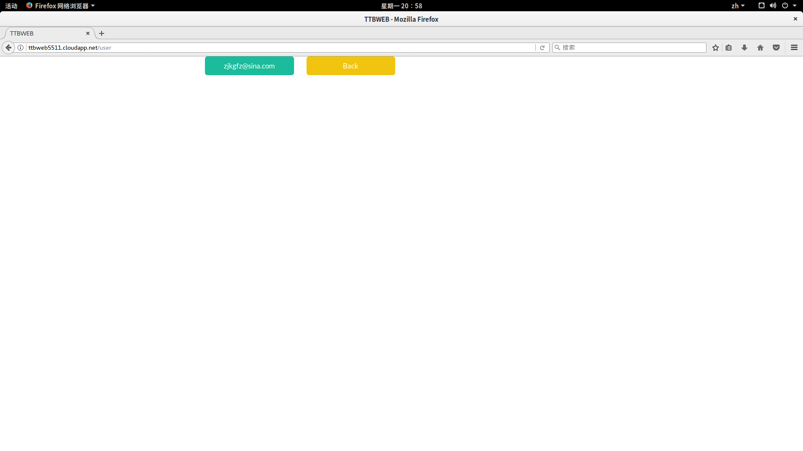

# OAuth 2.0 based Web Service Implementation

Powered By 计43 郭昉泽

1. 项目介绍：

   这是一个简单的实现了GitHub OAuth和domain expert finding功能的web服务。为了便于在云服务器上运行，实现了一个自动部署的程序，这个程序能够自动下载数据并进行数据的预处理。server.py是基于flask的主服务进程，使用flask运行即可。

   效果图如下：

   

   

   

   

   

   图1为登录界面，图2为登录后显示的界面，图3可以显示用户的邮件地址，图4可以根据对应的domain找到相应的author，并按照H-index排序，图5为点开图4的链接可以显示对应作者的详细信息。

2. 配置方法

   使用之前请先安装redis-server，并将redis-server运行在127.0.0.1地址下，端口为默认的6379。

   由于redis是一个基于内存的数据库，数据量较大，所以在运行前请保证系统有8GB的内存以满足需求。

   本项目的python版本为3.5，依赖于：

   flask，github-flask，sqlalchemy，numpy，redis，可使用pip3安装这些程序。

   安装完依赖之后，可以通过python3 makeredis.py来运行自动配置文件。运行时屏幕会打印配置状态。配置大概分为以下几步：下载coauthor文件，对coauthor文件逐行读取，将coauthor文件信息加入redis-server中，下载author文件，对author文件进行预处理去除多余的空行，读取每个author的信息并加入redis-server中，将在读取中一并得到的每个domain对应的author加入redis-server。运行时间稍长，请耐心等待。

   为了实现数据的下载和校验，这里使用了keras的相关代码来下载数据，再利用zipfile来解压缩得到数据。由于下载的文本数据并不会被再次利用，所以默认保存在了/tmp/.ttbweb/dataset中，重启后即自行删除，避免空间浪费。

   执行完成后，等待30秒让redis-server写入数据，即可运行sudo python3 server.py来启动服务器。默认会运行在80端口。

3. 链接

   请访问
   http://ttbweb5511.cloudapp.net/
   进行测试。

4. API接口（1）

   http://ttbweb5511.cloudapp.net/expert_finding?domain=
   要查询的domain，来查询一个domain对应的expert。返回一个json array数组，以H-index排序。例如：

   http://ttbweb5511.cloudapp.net/expert_finding?domain=Mountainous+Area

   返回

   ["Yong-zhu Xiong", "Run Wang", "Zhi Li"]

5. API接口（2）

   http://ttbweb5511.cloudapp.net/coauthors?author=
   要查询的author的id，来查询一个author的index对应的coauthor。返回一个json array数组，以合作次数排序。例如：

   http://ttbweb5511.cloudapp.net/coauthors?author=12345

   返回

   ["Todd Deshane", "Eli Dow", "Wenjin Hu", "Patrick F. Wilbur", "Jeanna Neefe Matthews", "Jeremy Bongio"]

6. 具体实现方法

   makeredis.py里的数据处理经过了这么几步：首先将coauthor数据读进来，然后建一个dict，让dict\[author1\]为一个jsonobject，由此dict\[author1\]\[author2\]=cooperatetime，author2author1同理，处理完将dict的数据装入redis，key为author的index，value为jsonobject转化为的json字符串。接下来将author数据读进来，先把author数据以key为author的index，value为以jsonobject表示的author的所有信息装入redis，再找到每个author对应的所有的domain，再建一个dict，使dict\[domain\]为一个jsonobject，里面存着所有author的index和H-index。最后将这个dict装入redis就可以了。

   server.py使用了github-flask来实现OAuth功能。首先会建立一个sqlite数据库来判断用户是否登录，如果未登录显示登录界面，当用户点击 login with github account时，就会进入github的OAuth认证界面，认证后会回调github-callback页面，将用户状态设置为登录，并跳转到根目录，但此时因为检测到用户已登录，所以显示登陆后的界面。当单击get user info的时候，会从github返回一个json字符串，将其解析得到email并填入到info页面的按钮中。当单击log out的时候，会将状态置为未登录，并返回登录界面。

   搜索框输入一个domain时，会从redis查这个domain对应所有author的index和H-index，按照H-index排序，然后查询每个author的index对应的author信息，做成html文本超链接格式并返回。单击链接之后，会查询对应的author信息，还会查询每个author对应的coauthor，按照合作次数排序，也做成html文本超链接格式返回。